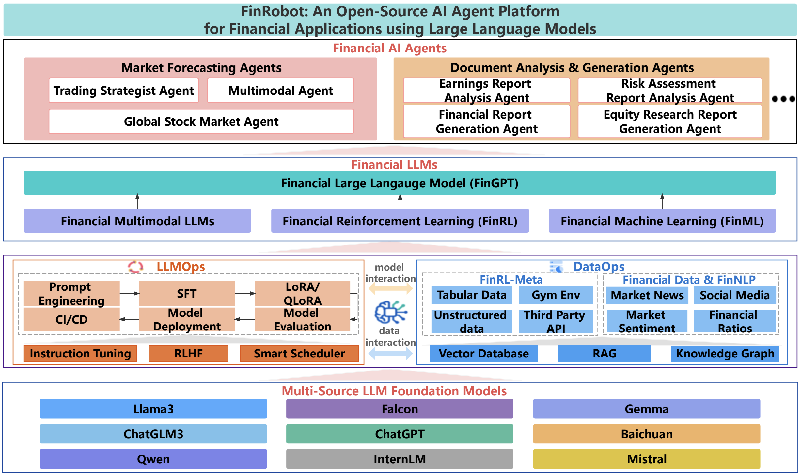

# Finance Copilot

[](https://www.python.org/)
[](LICENSE)

**Finance Copilot** is an open-source AI Agent platform tailored for financial applications. It unifies multiple AI technologies—including Large Language Models (LLMs), reinforcement learning, and quantitative analytics—to power investment research automation, algorithmic trading strategies, and risk assessment, delivering a full-stack intelligent solution for the financial industry.

Unlike traditional single-model approaches, Finance Copilot uses a multi-agent framework where a Lead Orchestrator coordinates specialized sub-agents to progressively execute complex workflows like stock analysis, valuation modeling, and report drafting.

---

## 🚀 Finance Copilot Desktop v0.1.0

Finance Copilot Desktop is a native equity research cockpit powered by a production-grade multi-agent architecture. It brings AI-native financial workflows into a desktop application, helping analysts move from raw market data and company filings to valuation, debate, synthesis, and investment committee-style reports in one traceable workflow.

### Key Capabilities
- **Multi-agent equity research**: Role-based agents collaborating on data gathering, analysis, modeling, and report writing.
- **Code-calculated valuation**: Deterministic compute paths for DCF, DDM, LBO, comps, WACC, and Monte Carlo analysis.
- **Traceable analyst reports**: Outputs detailed research reports with full provenance tracking and source evidence links.
- **Native desktop experience**: Structured on **PydanticAI + FastAPI + React/Tauri** with live data access and automatic failover.

### Multi-Agent Architecture

```text
User Research Request
        ↓
Lead Agent / Orchestrator
        ↓
Data Agent → Analysis Agent → Modeling Agent → Synthesis Agent → Report Agent
        ↓
Bull Agent ↔ Bear Agent → Judge Agent
        ↓
Traceable Investment Research Output
```

---

## 🎬 Finance Copilot Pro

**Finance Copilot Pro** is a locally-deployed AI assistant that fetches financial data, runs multi-agent LLM analysis, and generates professional equity research reports.

<div align="center">

</div>

### Getting Started & Configuration

**1. Configure API Keys**
```bash
cp finance_copilot_equity/core/config/config.ini.example finance_copilot_equity/core/config/config.ini
```
Edit the generated `config.ini` file with your keys:
```ini
[API_KEYS]
fmp_api_key = YOUR_FMP_API_KEY          # https://financialmodelingprep.com/developer
openai_api_key = YOUR_OPENAI_API_KEY    # https://platform.openai.com/account/api-keys
adanos_api_key = YOUR_ADANOS_API_KEY    # Optional: sentiment insights
```

**2. Modify OAI_CONFIG_LIST**
- Rename `OAI_CONFIG_LIST_sample` to `OAI_CONFIG_LIST` (if not already done).
- Add your own OpenAI or Azure OpenAI API keys.

**3. Modify config_api_keys**
- Rename `config_api_keys_sample` to `config_api_keys` (if not already done).
- Add your Finnhub, FMP, and SEC-API keys.

---

## Installation & Deployment

### Method 1: Deploying the Web Interface
To start the local web dashboard:
```bash
# Set up a new virtual environment
python3 -m venv .venv
source .venv/bin/activate

# Install dependencies
pip install -r requirements-equity.txt

# Start the web app
python run_web_app.py
```
Access the application locally at `http://127.0.0.1:8001`

### Method 2: Running via Command Line (CLI)

Run the full workflow sequentially:

```bash
# Step 1: Financial data fetching & analysis
python finance_copilot_equity/core/src/generate_financial_analysis.py \
    --company-ticker NVDA \
    --company-name "NVIDIA Corporation" \
    --config-file finance_copilot_equity/core/config/config.ini \
    --peer-tickers AMD INTC \
    --generate-text-sections

# Step 2: Generate PDF/HTML equity report
python finance_copilot_equity/core/src/create_equity_report.py \
    --company-ticker NVDA \
    --company-name "NVIDIA Corporation" \
    --analysis-csv output/NVDA/analysis/financial_metrics_and_forecasts.csv \
    --ratios-csv output/NVDA/analysis/ratios_raw_data.csv \
    --config-file finance_copilot_equity/core/config/config.ini
```

---

## File Structure

The project code is structured as follows:

```
Finance Copilot
├── finance_copilot (core framework)
│   ├── agents
│   │   ├── agent_library.py
│   │   └── workflow.py
│   ├── data_source
│   │   ├── finnhub_utils.py
│   │   ├── finnlp_utils.py
│   │   ├── fmp_utils.py
│   │   ├── sec_utils.py
│   │   └── yfinance_utils.py
│   └── functional
│       ├── analyzer.py
│       ├── charting.py
│       ├── coding.py
│       ├── quantitative.py
│       ├── reportlab.py
│       └── text.py
│
├── finance_copilot_equity (equity research module)
│   ├── core
│   │   ├── config/
│   │   ├── src/
│   │   └── tests/
│   └── web_app/
│
├── configs/
├── experiments/
├── tutorials_beginner/
│   ├── agent_forecaster.ipynb
│   └── agent_annual_report.ipynb
├── tutorials_advanced/
│   ├── agent_trade_strategist.ipynb
│   ├── agent_forecaster.ipynb
│   └── agent_annual_report.ipynb
├── setup.py
└── requirements.txt
```

---

## Disclaimer

**Disclaimer**: The code and documentation provided herein are released under the Apache-2.0 license. They should not be construed as financial counsel or recommendations for live trading. It is imperative to exercise caution and consult with qualified financial professionals prior to any trading or investment actions.
